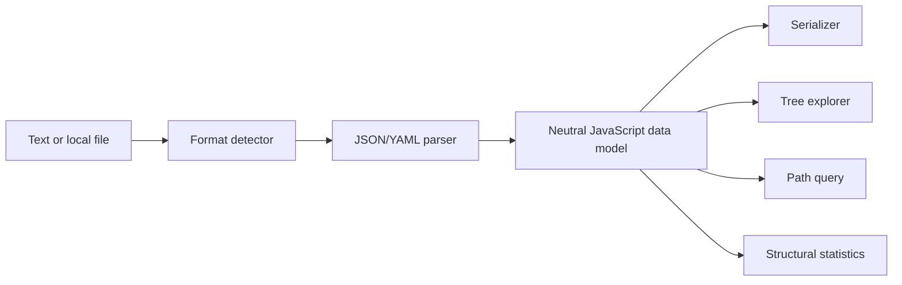

# Architecture

## Current shape

Structura is a static React application with a framework-independent transformation core. Parsing and serialization use the standards-focused `yaml` package and the platform JSON implementation.

## Boundaries

`src/lib/document.ts` owns format detection, parsing, serialization, statistics and path resolution. It has no UI state and no React dependency. Components receive data or errors and never parse independently.

The browser layer owns file selection, clipboard access and download URLs. Those effects remain behind explicit user actions.

## Planned packages

| Package | Responsibility |
| --- | --- |
| `@structura/core` | Neutral data model, transforms, paths and diagnostics |
| `@structura/schema` | JSON Schema validation and inference |
| `@structura/cli` | stdin/stdout pipelines and CI diagnostics |
| `apps/workbench` | Browser UI and local file workflow |

## Loss policy

JSON and YAML overlap but are not identical. Future support for YAML anchors, tags, comments and multi-document streams must surface loss explicitly. A transform must never imply round-trip preservation when the source contains constructs outside the target format's data model.
